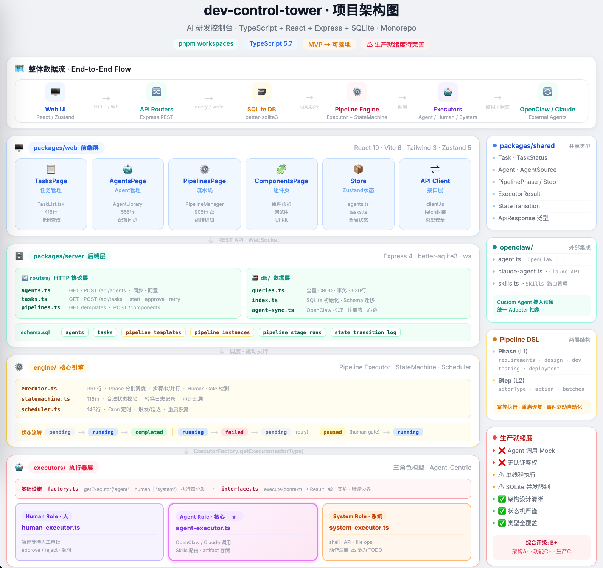

# dev-control-tower

[](https://www.typescriptlang.org/)
[](https://react.dev/)
[](https://expressjs.com/)
[](https://sqlite.org/)

**AI R&D Control Tower** - Multi-Agent Collaborative Pipeline Management System

> AI 研发控制台 - 基于多 Agent 协作的流水线管理系统

**dev-control-tower** is a pipeline orchestration platform that bridges AI agents (OpenClaw + Claude) with software development workflows. It provides a visual interface for managing multi-agent tasks, from planning to deployment, with built-in human approval gates.

---

## ✨ Core Features

- **🤖 Agent Management & Auto-Sync** — Unified management of OpenClaw and Claude agents with automatic synchronization
- **📊 Pipeline Orchestration & Visualization** — Visual pipeline editor with drag-and-drop workflow design
- **⚙️ Task Scheduling & State Machine** — Robust state machine ensuring valid state transitions with full audit trails
- **👤 Human Approval Nodes** — Configurable approval gates for critical stages
- **🔌 Multi-Agent Collaboration** — Seamless integration of OpenClaw and Claude agents with custom agent support

---

## 🏗️ Architecture

```
┌─────────────────────────────────────────────────────────┐
│                     Control Tower                        │
│  ┌─────────────┐  ┌─────────────┐  ┌─────────────────┐  │
│  │ AgentRouter │  │  Executor   │  │  StateMachine   │  │
│  └──────┬──────┘  └──────┬──────┘  └────────┬────────┘  │
└─────────┼────────────────┼──────────────────┼───────────┘
          │                │                  │
    ┌─────┴─────┐    ┌─────┴─────┐    ┌──────┴──────┐
    │ OpenClaw  │    │  Claude   │    │   Custom    │
    │  Agent    │    │  Agent    │    │   Agent     │
    └───────────┘    └───────────┘    └─────────────┘
```

**Architecture Diagram:** [View Interactive Diagram](./docs/dev-control-architecture.html) | [PNG Version](./docs/dev-control-architecture.png)



The system follows a layered architecture:
- **Frontend**: React + Vite + Tailwind + Zustand for state management
- **Backend**: Express + SQLite with better-sqlite3 for data persistence
- **Engine**: Pipeline executor with state machine, scheduler, and factory pattern for extensible executors
- **Integration**: OpenClaw and Claude agent clients with unified abstraction

---

## 🚀 Quick Start

```bash
# Clone the repository
git clone https://github.com/your-org/dev-control-tower.git
cd dev-control-tower

# Install dependencies
pnpm install

# Start development servers
pnpm dev
```

The development environment will start:
- Frontend: http://localhost:5173
- Backend API: http://localhost:3001

---

## 📌 Project Status

**MVP → Production Ready Phase** ⚠️

The project has completed core architecture design and basic functionality. Core business workflows (Agent real invocation) are currently in mock state. See [ARCHITECTURE_ANALYSIS.md](./docs/ARCHITECTURE_ANALYSIS.md) for detailed analysis.

**Current Readiness:**
- ✅ Architecture design complete
- ✅ Basic UI/UX implemented
- ✅ State machine and pipeline engine functional
- ⚠️ Agent real invocation pending (mock mode)
- ⚠️ Authentication not implemented

---

## 🛠️ Tech Stack

| Layer | Technology | Purpose |
|-------|------------|---------|
| **Frontend** | React 19 | UI framework |
| | Vite 6 | Build tool |
| | Tailwind CSS 3.4 | Styling |
| | Zustand 5 | State management |
| | lucide-react | Icons |
| **Backend** | Express 4.21 | Web framework |
| | better-sqlite3 11.7 | Database |
| | WebSocket (ws) | Real-time communication |
| | tsx | TypeScript runtime |
| **Shared** | TypeScript 5.7 | Type system |
| **Monorepo** | pnpm workspaces | Package management |

---

## 📁 Directory Structure

```
dev-control-tower/
├── packages/
│   ├── web/              # React frontend (Vite + Tailwind)
│   │   ├── src/
│   │   │   ├── components/
│   │   │   ├── pages/
│   │   │   └── store/
│   │   └── package.json
│   ├── server/           # Express backend + SQLite
│   │   ├── src/
│   │   │   ├── db/       # Database layer
│   │   │   ├── engine/   # Pipeline engine
│   │   │   ├── executors/# Executor implementations
│   │   │   ├── openclaw/ # OpenClaw/Claude integration
│   │   │   └── routes/   # API routes
│   │   └── package.json
│   └── shared/           # Shared TypeScript types
├── docs/                 # Documentation
│   ├── ARCHITECTURE_ANALYSIS.md
│   ├── dev-control-t-architecture.html
│   └── architecture-diagram.png
├── CLAUDE.md             # Development guidelines
├── package.json
└── pnpm-workspace.yaml
```

---

## 📝 Development Guidelines

See [CLAUDE.md](./CLAUDE.md) for:
- Code conventions and commit message formats
- Component usage guidelines (z-index, icons, accessibility)
- Core concepts (Agent, Pipeline Template, Task)
- Agent workflow (Plan → TDD → Code → Review → Commit)
- Database schema and important notices

---

## 🗺️ Roadmap

### Shortest Path to Production (2-3 weeks)

1. **Week 1**: Agent Real Invocation
   - [ ] Implement OpenClaw agent CLI invocation
   - [ ] Implement Claude API integration
   - [ ] Add 2-3 critical system actions (lint, build)

2. **Week 2**: Authentication & Security
   - [ ] JWT-based authentication
   - [ ] API permission control
   - [ ] Input validation

3. **Week 3**: Testing & Stability
   - [ ] Core engine unit tests
   - [ ] Executor mock tests
   - [ ] Basic E2E tests

### Standard Path (4-6 weeks)

- Complete shortest path items
- Add worker queue mechanism (Bull/Redis)
- Implement monitoring and logging
- API documentation (Swagger/OpenAPI)

---

## 🤝 Contributing

1. Follow the commit format: `feat:`, `fix:`, `refactor:`, `docs:`, `chore:`
2. Keep files under 800 lines
3. Keep functions under 50 lines
4. Use immutable data patterns
5. Target 80%+ test coverage

---

## 📄 License

[MIT License](./LICENSE)
