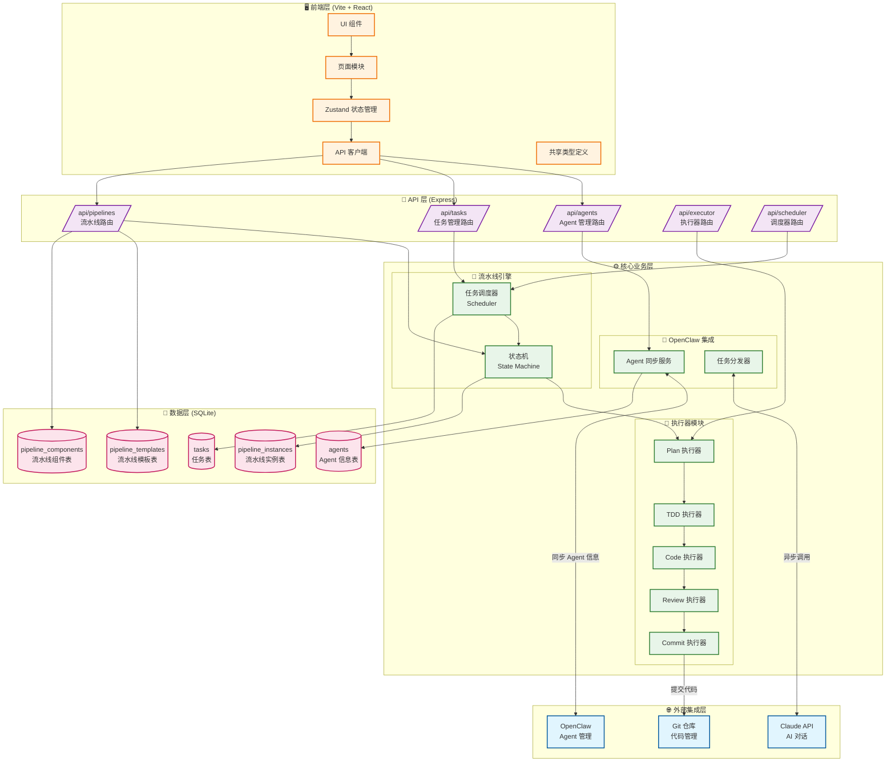
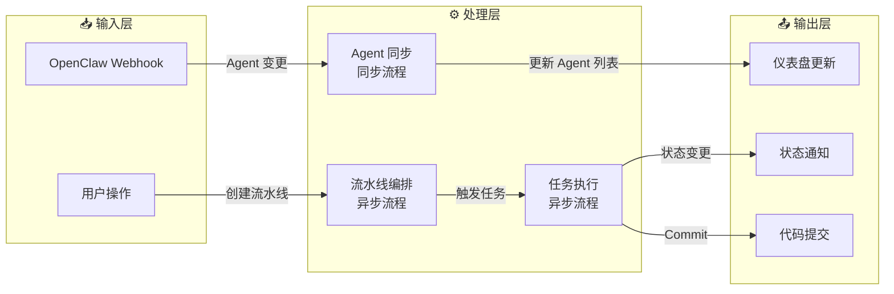
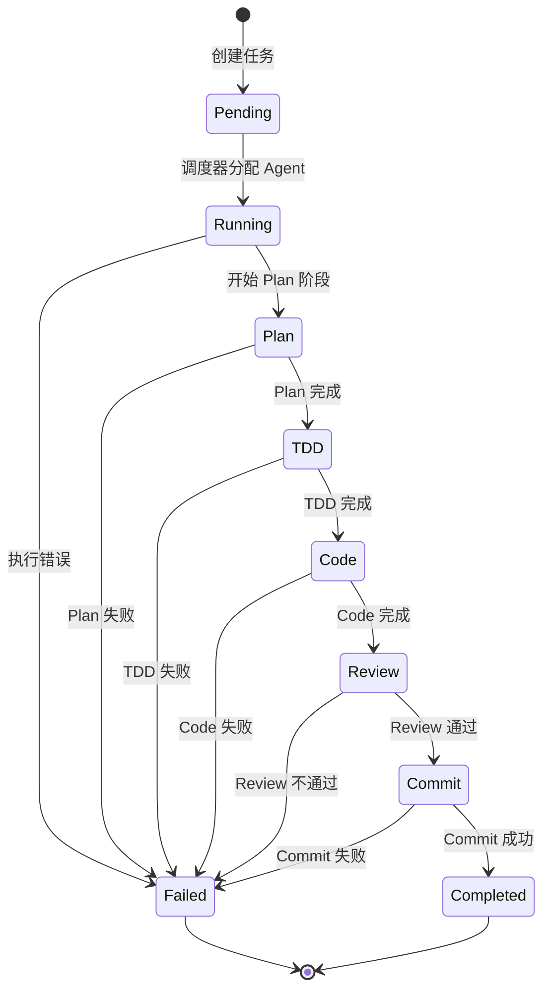

# Dev Control Tower 架构图

## 系统整体架构



## 数据流架构



## Agent 工作流状态机



## 核心模块说明

### 1. 前端层 (packages/web/)
| 模块 | 职责 |
|------|------|
| components/ | 可复用 UI 组件 |
| pages/ | 页面级组件 |
| store/ | Zustand 全局状态管理 |
| api/ | Axios API 客户端封装 |
| types/ | TypeScript 类型定义 |

### 2. API 层 (packages/server/src/routes/)
| 路由 | 功能 |
|------|------|
| /api/agents | Agent CRUD + 同步管理 |
| /api/tasks | 任务生命周期管理 |
| /api/pipelines | 流水线模板与实例 |
| /api/executor | 执行器控制 |
| /api/scheduler | 调度器管理 |

### 3. 核心业务层

#### 流水线引擎 (engine/)
- **Scheduler**: 任务调度与资源分配
- **StateMachine**: 流水线状态流转控制

#### 执行器 (executors/)
工作流阶段：
1. **Plan** → 需求分析与任务规划
2. **TDD** → 测试驱动开发
3. **Code** → 代码实现
4. **Review** → 代码审查
5. **Commit** → 代码提交

#### OpenClaw 集成 (openclaw/)
- **AgentSync**: 从 OpenClaw 同步 Agent 信息
- **TaskDispatcher**: 向 Claude 分发任务

### 4. 数据层 (SQLite)
| 表名 | 用途 |
|------|------|
| agents | 存储 Agent 信息及角色标签 |
| tasks | 任务状态与元数据 |
| pipeline_templates | 预定义流水线模板 |
| pipeline_instances | 运行时流水线实例 |
| pipeline_components | 流水线组件配置 |

## 同步 vs 异步流程

### 同步流程（即时响应）
```
用户操作 → API 调用 → 数据库操作 → 即时返回
```
- Agent 列表查询
- 流水线模板读取
- 任务状态查询

### 异步流程（后台处理）
```
任务创建 → 队列 → Scheduler → Agent 执行 → 状态回调
```
- 流水线执行
- Agent 任务分配
- 代码提交与同步

## 技术栈

| 层级 | 技术 |
|------|------|
| 前端 | React 18 + Vite + TypeScript + Zustand |
| 后端 | Express + TypeScript |
| 数据库 | SQLite3 |
| 包管理 | pnpm workspaces |
| 外部集成 | OpenClaw SDK + Claude API |

---
*Generated by AI Architect* 
*Last Updated: 2025-04-17*
